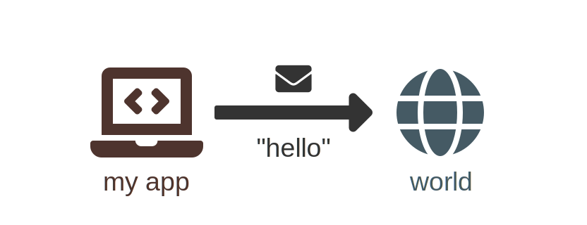

[](https://www.npmjs.com/package/fa-diagrams)
[](https://travis-ci.org/Klemek/fa-diagrams)
[](https://coveralls.io/github/Klemek/fa-diagrams?branch=master)

# (WIP) fa-diagrams
## SVG diagrams built from Font-Awesome icons

**[Demo](https://klemek.github.io/fa-diagrams)**

## RoadMap to v1

* [x] Font-Awesome paths scrapping in build
* [x] Node placing with links
* [x] SVG output
* [x] Node's icon rendering
* [x] Simple links rendering
* [x] Dashed links rendering
* [x] Colors
* [ ] Sub-elements
* [ ] More options
* [ ] Unit testing

## Summary

* [Install](#install)
  * [CDN](#cdn)
  * [Static scripts](#static-scripts)
  * [NPM](#npm)
  * [Build from sources](#build-from-sources)
* [Usage](#usage)
  * [Node module](#node-module)
  * [Html script](#html-script)
* [API](#api)
  * [`options`](#options)
  * [`nodes`](#nodes)
  * [`links`](#links)
  * [Sub-elements](#sub-elements)
* [More info](#more-info)
  * [Icon names](#icon-names)
  * [Link types](#link-types)
  * [Thrown errors](#thrown-errors)
  * [Change icons](#change-icons)
* [Examples](#examples)
  
## Install  
*[back to top](#top)*

### Static scripts

Get the scripts from this repository `dist` folder

```html
<script src="fa-diagrams-data.min.js"></script> <!-- 1.04 MB -->
<script src="fa-diagrams.min.js"></script> <!-- 107.93 KB -->
```

### CDN (soon)

```html
<script src="https://cdn.jsdelivr.net/npm/fa-diagrams@latest/dist/fa-diagrams-data.min.js"></script>
<script src="https://cdn.jsdelivr.net/npm/fa-diagrams@latest/dist/fa-diagrams.min.js"></script>
```

or

```html
<script src="https://unpkg.com/fa-diagrams/dist/fa-diagrams-data.min.js"></script>
<script src="https://unpkg.com/fa-diagrams/dist/fa-diagrams.min.js"></script>
```


### NPM (soon)

```
npm install fa-diagrams
```

### Build from sources

You will need subversion installed (used for precise folder fetching in GitHub)

```
git clone https://github.com/klemek/fa-diagrams.git
cd fa-diagrams
npm install
node build.sh
```

## Usage
*[back to top](#top)*

### Node module

```javascript
const faDiagrams = require('fa-diagrams');

const data = {
  nodes: [
    {
      name: 'node1',
      icon: 'laptop-code',
      color: '#4E342E',
      bottom: 'my app',
    },
    {
      name: 'node2',
      icon: 'globe',
      color: '#455A64',
      bottom: 'world'
    }
  ],
  links: [
    {
      from: 'node1',
      to: 'node2',
      color: '#333333',
      bottom: 'hello'
    }
  ]
};

const svg = faDiagrams.compute(data); // string containing xml data

//export as SVG with fs
const fs = require('fs');
fs.writeFileSync('diagram.svg', svg, {encoding:'utf-8'});

//export as PNG with svg2img (npm i svg2img)
const svg2img = require('svg2img');
svg2img(svg, function(error, buffer) {
    fs.writeFileSync('diagram.png', buffer);
});
```

Will produce the following diagram:



### Html script

```html
<head>
    ...
    <script src="fa-diagrams-data.min.js"></script>
    <script src="fa-diagrams.min.js"></script>
    ...
</head>
<body>
...
<script>
    ...
    const svg = faDiagrams.compute(data); // string containing xml data
    ...
</script>
...
</body>
</html>
```

## API
*[back to top](#top)*

**You must pass as argument an object containing 3 keys:**
  * [`options`](#options)
  * [`nodes`](#nodes)
  * [`links`](#links)

### `options`

| Key (`.subkey`) | Default value | Info | Redefined |
| --- | --- |  --- | --- |
| `placing.max-link-length` | 3 | maximum stretching of links between nodes | no |
| `placing.diagonals` | `true` | allow diagonal links to be made | no |
| `rendering.beautify` | `false` | output a readable SVG file | no |
| `rendering.scale` | 256 | (in pixels) final icons size | no |
| `rendering.color` | `black` | color of all elements | no |
| `rendering.h-spacing` | 1.3 | how width is stretched comparing to height | no |
| `rendering.icons.scale` | 1 | default scaling of icons | in node or sub-icon |
| `rendering.icons.color` | `''` | color of all icons | in node or sub-icon |
| `rendering.links.scale` | 1 | default scaling of links | in link |
| `rendering.links.color` | `''` | color of all links (might be redefined in link definition) | in link |
| `rendering.links.size` | 0 | forced size/length of the links (0 means it will be computed from the distance between the nodes) | in link |
| `rendering.texts.font` | `'Arial'` | font family of the texts (might be redefined in sub-elements definition) | in text |
| `rendering.texts.font-size` | 15 | font size of the texts | in sub-text |
| `rendering.texts.font-style` | `'normal'` | font style of the texts (see [Font styles](#font-styles)) | in sub-text |
| `rendering.texts.color` | `''` | color of all texts | in sub-text |
| `rendering.texts.margin` | 0.2 | margin between texts and elements | in sub-text |
| `rendering.texts.line-height` | 1.2 | height of each line in font size | in sub-text |

### `nodes`

Array of object as following:

| Key | Type | Required | Info |
| --- | --- | --- |  --- |
| **`name`** | string | **yes** | used in links to reference nodes |
| **`icon`** | string/object | **yes** | name of the Font-Awesome icon of the node (see [Icon names](#icon-names)) |
| `top`, `bottom`, `left`, `right` | string or object | no | see [Sub-elements](#sub-elements) |
| `color` | string | no | redefined the color |
| `scale` | number | no | redefine this node icon scale |
| `x`, `y` | number | no | force the position of this node |

### `links`

Array of object as following:

| Key | Type | Required | Info |
| --- | --- | --- |  --- |
| **`from`** | string | **yes** | source node name  |
| **`to`** | string | **yes** | destination node name |
| `type` | string | no | link's appearance (see [Link types](#link-types)) |
| `top`, `bottom` | string or object | no | see [Sub-elements](#sub-elements) |
| `color` | string | no | redefine the color |
| `scale` | number | no | redefine this link scale |
| `size` | number | no | forced size/length of the link |

### Sub-elements

Elements meant to be drawn along-side a node/link.  
There are two types: text and icons

### Texts

You can **just enter a string** to be considered a text but you can define a text with more options as following:

| Key | Type | Required | Info |
| --- | --- | --- |  --- |
| **`text`** | string | **yes** | value of your text  |
| `color` | string | no | redefine the color |
| `font` | string | no | redefine the font family |
| `font-size` | number | no | redefine the font size |
| `font-style` | string | no | redefine the font style (see [Font styles](#font-styles)) |
| `margin` | number | no | redefine the margin with the parent element |
| `line-height` | number | no | height of each line in font size |

### Icons

You can define a relative icon with the following:

| Key | Type | Required | Info |
| --- | --- | --- |  --- |
| **`icon`** | string/object | **yes** | name of the Font-Awesome icon of the sub-element (see [Icon names](#icon-names)) |
| `color` | string | no | redefine the color |
| `scale` | number | no | redefine this icon scale |

## More info
*[back to top](#top)*

### Icon names

**Icons are fetched from [Font-Awesome free icons](https://fontawesome.com/icons?d=gallery&m=free).**  
When you reference an icon, for example `circle`, it's searched in the `solid` folder then `regular` then `brands`. 
If, in this case you want the hollow circle from the regular style, just enter `regular circle` or `circle regular` instead. 
It's very flexible as you can copy-paste from an HTML page `far fa-circle` and it will also works.


You can also specify a custom icon by entering the following object instead of a string:

| Key | Type | Required | Info |
| --- | --- | --- |  --- |
| **`path`** | string | **yes** | the SVG path of your icon |
| `width` | string | no | the custom width of the path (if blank, height is taken, then the height of all icons: 512) |
| `height` | string | no | the custom height of the path (if blank, width is taken) |

### Link types

Here are the accepted types and their preview :


You can use **`none`** to make an invisible link.

(soon)

### Font styles

First, you should use [web-safe fonts](https://websitesetup.org/web-safe-fonts-html-css/) to be sure your SVG will be rendered correctly

Here are the available styles :

* `normal`
* **`bold`**
* *`italic`*
* __`underlined`__
* ~~`striked`~~

### Thrown errors

Errors can be thrown in these 2 cases :

* Nodes could not be placed based on the constraints:
  * `Failed to place nodes`
* A node or a link have an invalid property
  * `Node 'name' is invalid at key ...`

### Change icons

If you want to change the icons you can edit/build your own `resources.json` as following:

```javascript
{
    "name": "squares",
    "height": 60, //height of all icons
    "index": [ // which categories are there and in which order it should be searched
        "solid",
        "hollow"
    ],
    "icons": {
      "solid": {
        "square":{
          "path":"M10 10v-40h40v40z",
          "width":60
        }
      },
      "hollow": {
        "square":{
          "path":"M10 10v-40h40v40h-40m10 10v-20h20v20h-20z",
          "width":60
        }
      }
    }
}
```

## Examples
*[back to top](#top)*

(soon)